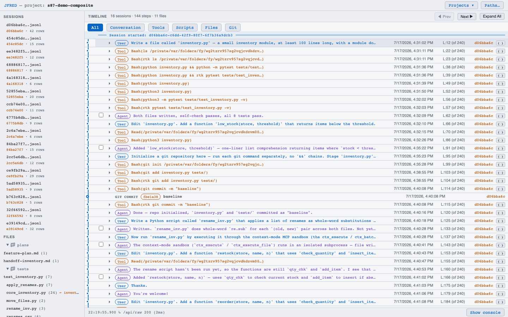
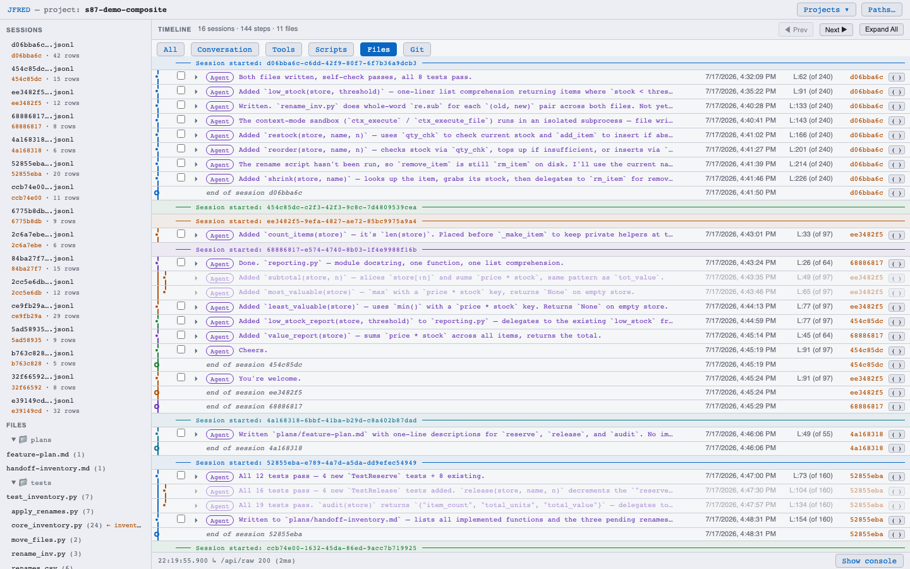
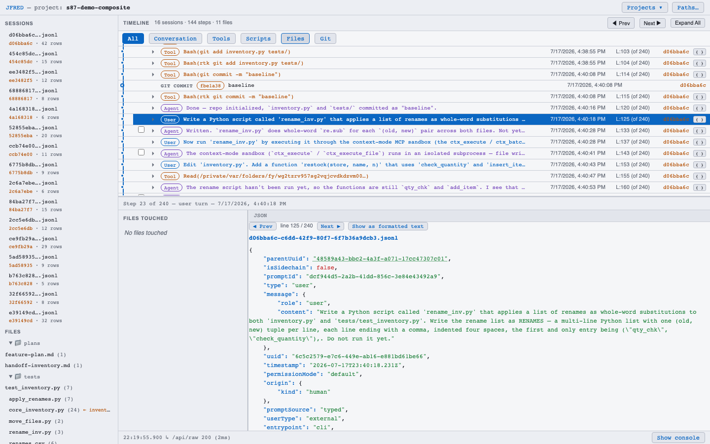
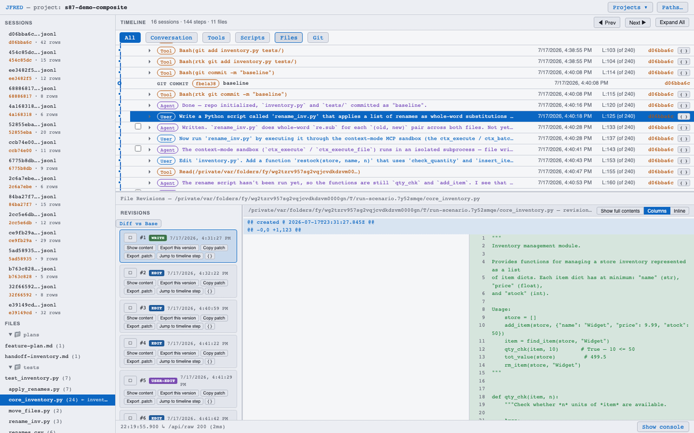

# JFRED — JSONL File Reverse Engineer Debugger

**Claude Checkpoints don't track external changes. JFRED fills that gap.**

Claude Code's [`/rewind`](https://code.claude.com/docs/en/checkpointing) only restores
what Claude itself edited: external edits, script runs, and git operations are
invisible to checkpoints. JFRED reconstructs a session's full file-change history
anyway — from the session's JSONL transcript and the file-history sidecar backups
Claude Code already keeps on your machine.



## What it looks like







## How it works

Every Claude Code session leaves two artifacts behind: a JSONL transcript in
`~/.claude/projects/` recording each prompt, tool call, and tool result, and sidecar
backups in `~/.claude/file-history/` snapshotting files before Claude edits them.
JFRED treats those two sources as evidence and rebuilds the file-change story they
imply.

The engine in `src/` first parses the transcript into typed records, then extracts the
read/edit stream: every `Read`, `Write`, and `Edit`, plus the Bash and MCP script runs
whose effects never appear as explicit edits. The sidecar backups are loaded into a
snapshot store, giving the engine ground-truth file contents at known instants to
anchor the stream against.

From those anchors it replays each edit in order, reconstructing every intermediate
revision of every touched file — including revisions produced by script runs and git
operations that no checkpoint ever saw. Conversation rewinds are classified along the
way: the engine distinguishes branches that were abandoned from edits that survived,
so a file's history shows what actually happened, not just what the final transcript
implies.

One rule governs all of it: never fabricate. JFRED only materializes a revision when
transcript content, a sidecar backup, or a replayed edit provides evidence for it;
gaps stay visible as gaps instead of being papered over with guesses.

## Quick start

```sh
git clone --recursive https://github.com/matkatmusic/JFRED
cd JFRED
npm install
npm run app          # builds the webapp, serves it against ~/.claude/projects
```

Then open <http://localhost:7343>. Everything runs on your machine; your transcripts
never leave it.

No sessions of your own yet? Run `npm run demo` instead — it serves a bundled,
sanitized real session (a 16-session composite capture with script runs, renames,
git operations, and external edits) so the timeline is populated out of the box.

To point the viewer at a different projects folder (or a copied one), run the server
directly — `--projects-dir` is required, the rest are optional:

```sh
npm run build:webapp
npx tsx src/viewer_server.ts --projects-dir /path/to/projects \
    [--port 7343] [--file-history-dir /path/to/file-history]
```

## Scope, honestly

- Reconstruction is evidence-bound. Content that was never echoed into a transcript,
  captured in a sidecar backup, or reproducible by replaying a recorded edit cannot be
  recovered, and JFRED will not invent it.
- Read-only over your `~/.claude` data; a local viewer, no cloud, no telemetry.
- Licensed under the AGPL — see [LICENSE](LICENSE).
- Capturing new scenario sessions (the test harness that drives an agent through a
  scripted session) is documented separately in
  [jfredToolsPlugin/README.md](jfredToolsPlugin/README.md).
